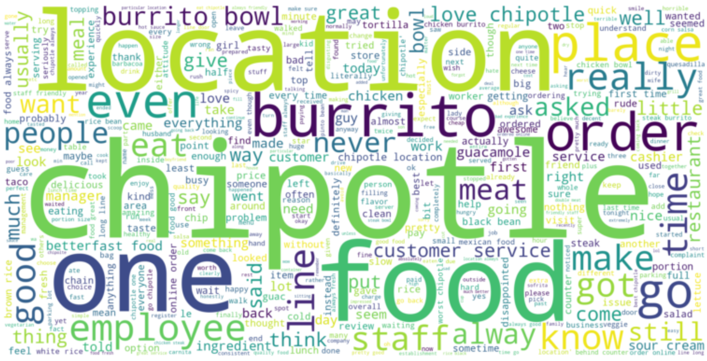

# chipotle-review-sentiment

## Setup
Download the complete dataset from [this link](https://www.yelp.com/dataset/download). Place files `business.json` and `review.json` in the repository root.

---
## Run
See `Chipotle Yelp Reviews Sentiment Analysis.ipynb`.

---
## Blog Post
See my [Medium blog post](https://towardsdatascience.com/time-series-analysis-of-chipotles-yelp-reviews-with-natural-language-processing-75e11bf3074f) for complete analysis.
